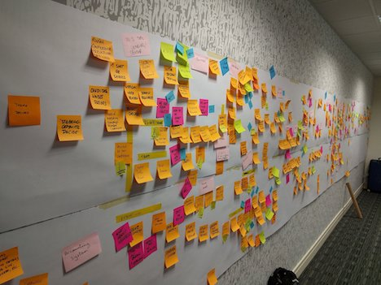
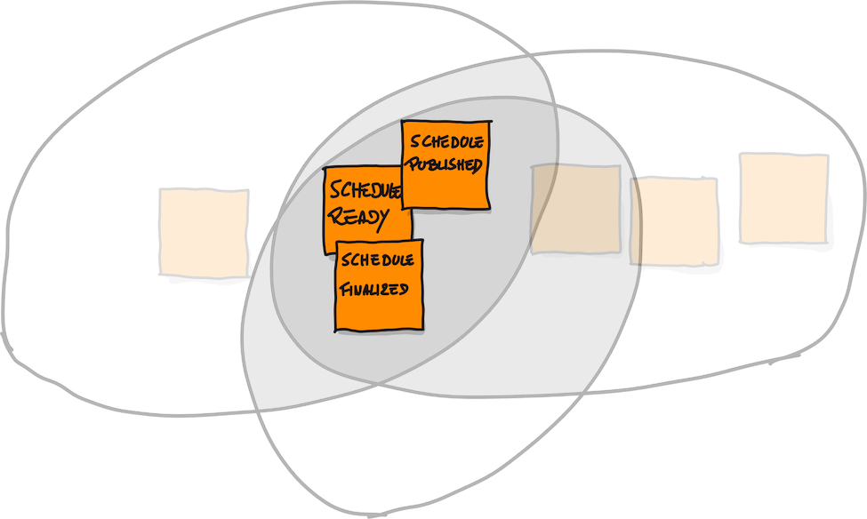
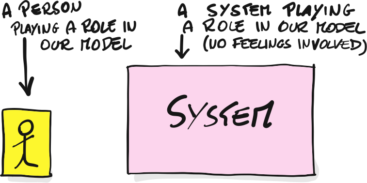
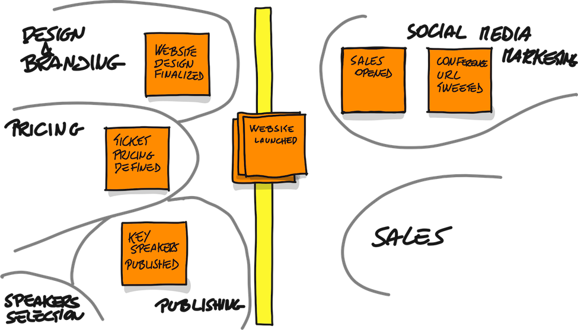
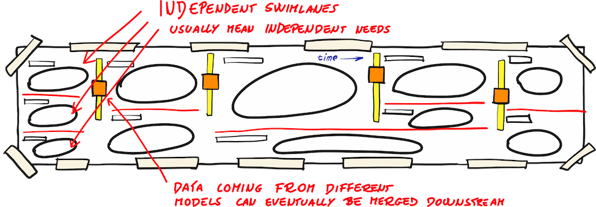
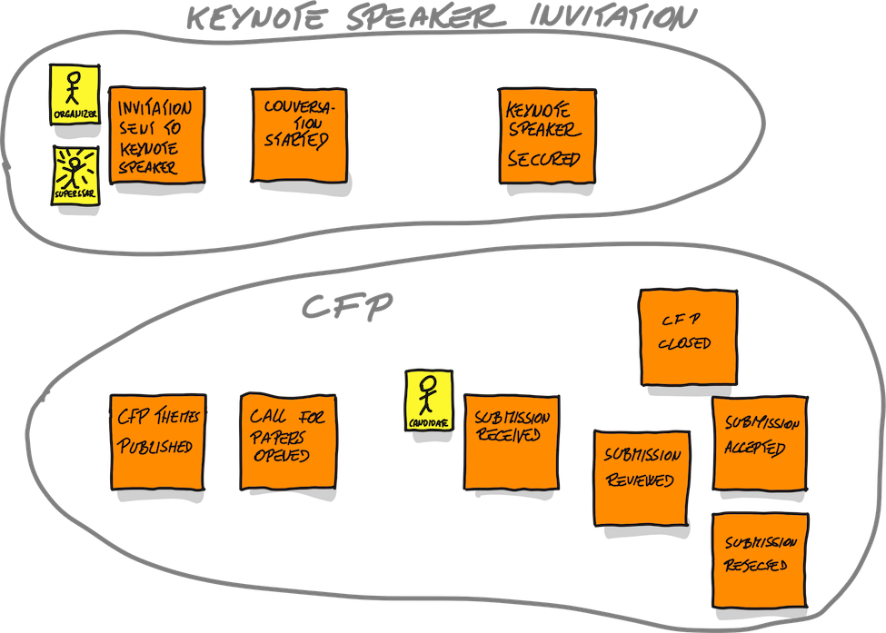
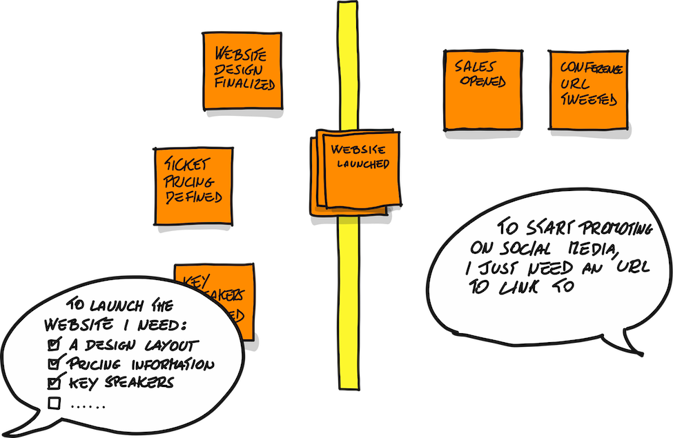

# Discovering Bounded Contexts with EventStorming — Alberto Brandolini

There's plenty of outcomes from a Big Picture EventStorming, the most obvious being the collective learning that happens throughout the workshop. However, learning is not the only one!

In this essay, we'll see how to leverage EventStorming to discover candidate bounded contexts in a complex domain.

## Why Bounded Contexts are so critical

Among the many ideas coming with Domain-Driven Design, Bounded Contexts have been initially hard to grasp, at least for me. It took me a while to realize how powerful and fundamental this concept is.

In 2004, I was probably too good at building monoliths, or maybe I just hadn't seen anything different yet. In a few years, after seeing a few consequences of mainstream architectural practices, I radically changed my mind.

Now I consider _“getting the boundaries right”_ the single design decision with the most significant impact over the entire life of a software project. Sharing a concept that shouldn't be shared or that generates unnecessary overlappings between different domains will have consequences spanning throughout the whole sociotechnical stack.

Here is how it might happen.

* A common concept (like the `Order` in an e-commerce web shop) becomes vital for several business capabilities, raising the need for reliability and availability, up to the unexplored limits of the CAP theorem, where buying more expensive hardware can't help you anymore.
* Security and access control get more complicated: different roles are accessing the same information, but _not exactly the same_, hence the need for sophisticated filtering.
* Changing shared resources requires more coordination: _“we have to be sure”_ we are not breaking anyone else's software and plans. The result is usually more and more meetings, more trade-offs, more elapsed time to complete, and less time for proper software development.
* Since everybody now depends on 'the Order', be it a database table, a microservice or an Order Management System, changing it becomes riskier. Risk aversion slowly starts polluting your culture; necessary changes will be postponed.
* Developers begin to call the backbone software _“legacy”_ with a shade of resentment. It's not their baby anymore; it's just _the thing that wakes them up in the middle of the night_.
* Adding refactoring stories to your backlog becomes a farce: since there is no immediate business value to be delivered, refactoring is being postponed or interrupted. Your attempts to explain “technical debt” to your non-technical colleagues always leave you disappointed.
* The time it takes to implement changes to the core of your system is now unbearable. Business departments stop asking changes in those areas and are implementing workarounds by themselves.
* Now your workplace isn't just that fun anymore. Some good developers that made it great are now looking for more challenging adventures.
* The business isn't happy either: delayed software evolution caused some business opportunities to be missed, and new players are moving on the market at a speed that is inconceivable with your current software.

So here you are, yelling at the sky, asking yourself: _“What did we do wrong?”_

And a likely answer is: _“We didn't get the right context boundaries.”_

## Finding bounded contexts

Ideally, a bounded context should contain a model tailored around a specific *purpose*: the perfectly shaped tool for one specific job, no trade-offs.

Whenever we realize a different purpose is emerging, we should give a chance to a new model, fitting the new purpose, and then find the best way to allow the two models interact.

Unfortunately, _a single specific purpose_ is not a very actionable criterion to discover boundaries in our model. The idea of 'purpose' is too vague to draw actionable boundaries: developers might be looking for a clear, well-defined purpose, while business stakeholder might be a little more coarse-grained, like “I need an Employee Management Solution[^MINAP].”

In general, we can't assume the business side to know about bounded contexts. BCs are mostly a software development issue, and the learning loop about them will be closed in software development first.

Put in another way, the business stakeholders are not a reliable source of direct information about bounded contexts. _Asking_ about bounded context will get you some information, but the answer can't be trusted blindly.

It's our job as software architects to discover boundaries in our domain, and this will be more an investigation on a crime scene than a _tick-the-checkboxes_ conversation.

Nobody knows the whole truth. Let's stop pretending somebody can.

## Enter EventStorming

EventStorming is a flexible workshop format that allows a massive collaborative exploration of complex domains. There are now several recipes[^ESR], but the one that better fits our need to discover context boundaries is the **Big Picture EventStorming**: a large scale workshop (usually involving 15-20 people, sometimes more) where software and business practitioners are building together a behavioral model of a whole business line.

At the very root the recipe is really simple:

* make sure all the key people (business _and_ technical stakeholders) are in the same room;
* provide them with an unlimited modeling surface (usually a paper roll on a long straight wall plus some hundreds of colored sticky notes);
* have them model the entire business flow with **Domain Events** on a timeline.

In an EventStorming workshop, domain events — or just _events_ — are not software constructs: they're short sentences written on a sticky note, using a verb at the past tense.

With a little facilitation magic, in a few hours, we end up with a big behavioural model of the entire organization: something like the one in the picture below.

A massive flood of colored sticky notes, apparently. But, as the adagio says, _it's the journey, not the destination_: the process of visualizing the whole business flow, with the active participation of all the key stakeholders, is our way to trigger critical insights and discoveries.

## Structure of a Big Picture workshop

To make things clearer, let's see the main steps in the workshop structure, focusing mainly on the steps that provide critical insights to Bounded Contexts discovery.

### Step 1. Chaotic Exploration

This is where workshop participants explore the domain, writing verbs at past tense on sticky notes (usually orange), and place them on the wall, according to an ideal timeline.

The key trick here is that nobody knows the whole story. Imagine we're exploring the domain of conference organization[^CALM]: there will be roles that know about strategy and market positioning, others specialized in dealing with primadonna speakers, plus a variety of other specialists or partners dealing with video coverage, catering, promotional materials and so on.

If you know one job well, you probably won't have time to know every other job at the same depth. This fragmentation of expertise is exactly what we're expecting to find in every business: local experts, masters of their silo, with variable degrees of understanding of the other portions of the business.

The more participants, the harder it is to follow a timeline: diverging perspectives and specialized view on what the business is really doing will usually lead to **clusters of locally ordered events, in a globally inconsistent whole**.

Far from perfect, but a good starting point. Now we see stuff.

Moreover, this first step is usually _silent_: people will quietly place their braindump on the wall, wherever there's enough space available. Not so many conversations are happening. Next steps will be noisier.

#### Divergence as a clue

Actually, we want this phase to be quiet: people should not agree yet about what to write on sticky notes. The facilitator should make sure that there is plenty of markers and stickies so that everybody can write their interpretation of the flow independently, without influencing each other too much.

As a result, we'll end up with a lot of _duplicated_ sticky notes, or _apparently duplicated_ ones.

It's usually a good idea to resist the temptation to resolve those duplicates and find and _agree_ on a single wording choice. Different wording may refer to different perspectives on the same event, hinting that this might be relevant in more than one Bounded Context, or that the two or more events aren't the same thing.

Getting back to our conference scenario, we might expect to have a few domain events referring more or less to the same thing, with different wording. Something like: `Schedule Ready`, `Schedule Completed`, `Schedule Published` and so on.

This discordance is already telling us something: this event (assuming or pretending there's only one event here) is probably relevant for different actors in the business flow.

That's cool! It might be a hint of multiple overlapping contexts.

I didn't say _“bounded”_ because the boundaries aren't clear yet.

### Step 2. Enforce the Timeline

In this phase, we ask participants to make sure there is a consistent timeline describing the business flow from a beginning to an end.

It won't be that easy: there'll be parallel and alternative paths to explore. Even big-bang businesses, like conference organization, tend to settle on a repeating loop, usually repeating every year.

The need to come up with _one consistent view_ of the entire business triggers **conversations** around the places where this view is not consistent. People start asking questions about what happens in obscure places, and they'll get an answer because we made sure the _experts are available!_

At the same time, we'll have diverging views about how a given step should be performed. Some conflicts will be settled — after all it's just a matter of having a conversation — other will be simply highlighted with a **Hot Spot** (usually a sticky note in the red spectrum, like magenta), to let the exploration flow.

[FIXME: picture of a hotspot.]

HotSpots clarify the underlying approach of our exploration: we're not here to _solve everything_, there is just no time for that. However, we can try to _visualize everything_ including things that are unclear, uncertain or disputed.

The Big Picture EventStorming will deliver **the snapshot of our current collective level of understanding of the business** including holes and gaps.

### Emerging structure

Simply talking about problems and moving sticks around won't do justice to the insights and discoveries happening during this phase. This is where participants often look for a more sophisticated structure, to sort out the mess they just created.

There are a few strategies to make the emerging structure visible. The most interesting for discovering bounded contexts are *Pivotal Events* and *Swimlanes*.

#### Using Pivotal Events

Pivotal Events are specific events which are particularly relevant for the business and mark a transition between different business phases.

In our conference organization scenario, we might spot a few candidates.

* `Conference Website Launched` or maybe `Conference Announced`: this is when you may start to sell tickets, but at the same time you can't easily withdraw anymore.
* `Conference Schedule Announced`: now, the speakers are officially in and ticket sales should start.
* `Ticket Sold`: on one side, here is a relevant business transaction, with money finally coming in; on the other one, we now have a *customer* and/or an *attendee* and a lot of specific communications that we'll have to manage.
* `Conference Started`: this is where attendees are expecting to get some value back from the ticket they purchased. Same goes for speakers looking for insights or contacts, and sponsors.
* `Conference Ended` looks like an obvious one. The party is over, let's deal with the aftermaths.

I usually mark the candidate events with colored tape, so that they're visible and we have a visible hint of distinct phases.

It doesn't matter to pick the right ones, so I often keep this discussion short. I look for 4-5 candidate events that seem to fit that role. Mostly to sort out the internal events faster. We can still improve the model later if needed.

After highlighting pivotal events, sorting becomes a lot faster inside the boundaries, and a more sophisticated structure starts to emerge.

#### Using Swimlanes

Even in the most straightforward businesses, the flow is not linear. There are branches, loops and things that happen in parallel. Sometimes the touch points between different portions of the flow are well-defined, like _billing_ getting triggered only around the events of a sale, or maybe a cancellation. Other times, the relationship can be more complicated: announcing some famous speaker can boost sales, sales can attract sponsors, sponsorships can allow organizers to afford the paycheck for more superstars speakers, which can trigger more sales and eventually trigger a venue upgrade.

**Horizontal Swimlanes** is a common way to structure portions of the whole flow. It usually happens after pivotal events, but there's no strict recipe here: the emerging shape of the business suggests the more effective partitioning strategy.

In our conference scenario, we can spot a few main themes that happen more or less in parallel: a _Speaker Management Flow_ dealing with theme selection, call for papers and invitation, logistics and accommodation; a _Sales Management Flow_ dealing with ticket sales, advertising, logistics and everything needed to welcome attendees, a _Sponsor Management Flow_ managing the other revenue stream; and last but not least a lot of not so ancillary areas, from venue management, to catering, staffing, video recording and so on.

Our replaceable tape comes in handy also to give a name to these parallel flows. The underlying structure backbone will now probably look something like this:

Everybody now sees the different _phases_ of the business and the key relevant issues at every step.

### Step 3. People and Systems

In this phase, we start exploring the surroundings of our business, explicitly looking for **people**: actors, users, personas, or specific roles in our system; and **systems**: from software components and tools to external organizations. Nothing excluded.

Visualizing different actors in our system — in practice, we don't call them _actors_ just _people_ — helps to dig into the different perspectives. We might discover specific responsibilities and roles, or differing perceptions: all speakers are submitting talks, but the treatment can be different if we're talking about a superstar guest, invited as a keynote speaker, an expert or a newbie. A puzzled look during this exploration phase may end up in opening an entirely new branch or making different strategies more visible and readable.

Systems usually trigger a different type of reasoning. On the one hand, they make our boundaries explicit. We won't be able to deliver value in a vacuum, with self-contained software: tools, integrations, and collaborations are needed to complete the flow. Payment management systems, ticketing platforms, social media platforms, video streaming, billing software, and whatever comes to mind.

Systems can also be external entities like government agencies, or something as vague as “the weather” (which might be a severe constraint if you are organizing a conference in extreme regions, or if you're so lucky to get a snow storm the day before).

From the software perspective, an external system calls for some integration strategy (maybe our all-time favorite: the Anti-Corruption Layer), but from the business perspective, external systems often impose constraints, limitations or _alibis_, a free scapegoating service if anything goes wrong.

### Step 4. Explicit Walkthrough

Every step triggers some clarification and prompts writing more events. Even if we added some structure, with pivotal events and swimlanes, and had some interesting conversation on the spot, the whole thing still feels messy. Probably because it is still messy.

It's now time to validate our discoveries, picking a _narrator_ trying to tell the whole story, from left to right. Consistent storytelling is hard, in the beginning, because the narrators' brain will be torn apart by conflicting needs. Narrators will try to tell the story using the existing events as building blocks, but at the same time, they'll realize that what seemed _good enough_ in the previous reviews is not good enough for a public _on stage_ storytelling session.

Now our model needs to be improved, to support storytelling. More events will appear, others will be moved away, paths will be split and so on.

The audience should not be passive. Participants are often challenging the narrator and the proposed storytelling, eventually providing examples of corner cases and not-so-exceptional-exceptions.

The more we progress along the timeline, the more clarity is provided to the flow, while the narrator is progressing like a _defrag cursor[^IYOETR]_.

### Extra steps

There are a few extra steps that might be performed now, usually depending on the context, that may provide more insights. I'll describe them briefly.

* We sometimes explore the **value** that is supposed to be _generated_ or unfortunately _destroyed_ in the business flow. We explore different currencies: money being the most obvious one, often to discover that others are more interesting (like _time_, _reputation_, _emotional safety_, _stress_, _happiness_, and so on).
* We explore **problems** and **opportunities** in the existing flow, allowing everyone to signal issues that didn't surface during the previous steps, or to make improvement ideas visible.
* We might challenge the status quo with an **alternative flow**: once the understanding of the current situation is settled, what happens if we change it? Which parts are going to stay the same and which ones are going to be radically changed or dismissed?
* We might **vote the most important issue** to leverage the clarity of collective understanding into political momentum to do the right thing[^PTCD].

All this stuff, plus more, is usually awesome! But most of the information needed to sketch context boundaries is already available if you take a closer look.

Deriving this information from our workshop is now our job as software architects.

## Homework time

Once the workshop is officially over, and participants left the workshop room, we can start talking software, ..._finally!_

I used to draw context maps, as a way to _force myself to ask the right questions early in the project_, now I run EventStorming workshops, and I engage stakeholders in providing the right answers without asking the corresponding questions.

There's a lot of Bounded Context related info that comes as a byproduct of our discussion; we only need to decipher the clues. So, here we are with some heuristics[^IUTWHJTMMH], that may come in handy.

### Heuristic: look at the business phases

...or like detectives would say: _“follow the money!”_ Businesses grow around a well-defined business transaction where some value — usually money — is traded for something else. Pivotal events have a fundamental role in this flow: we won't be able to sell tickets online without a website, everything that happens before the website goes live is _inventory_ or _expenses_, we can start making money only after the `Conference Website Launched` event.

Similarly, after `Ticket Sold` events, we'll be the temporary owners of attendees' money, but they'll start to get some value back only around the `Conference Started` event. But the tools and the mental models needed to _design_ a conference, are not the same tools needed to _run_ a conference.

Interestingly, boundary events are also the ones with different conflicting wordings. Here is where the perception of bounded contexts usually overlaps. A key recommendation here is that _you don't have to agree on the language!_ There's much more to discover by making disagreements visible.

Moreover, keep in mind that when two models are interacting, there are usually _three_ models involved: the internal models of the two bounded contexts and the _communication model_ used to exchange information between them.

A simple example: I am trying to communicate with my readers using the English language, but I am not a native English speaker. My internal reasoning model is sometimes English too, and sometimes Italian. But readers shouldn't be able to tell (I hope). At the same time, this text is not intended for British and American people only, every reader will translate into their mental model, possibly in their native language.

In general, **different phases** usually mean **different problems**, which usually leads to **different models**.

**Pivotal Events** are usually part of a more general _published language_ shared between the different parties.

The picture above shows more or less what I am seeing when looking at the flow with Bounded Contexts in mind.

### Heuristic: look at the swimlanes

Swimlanes often show different paths that involve different models.

Not every swimlane is a Bounded Context, sometimes they're just an _if_ statement somewhere, but when swimlanes are emerging for the need to highlight an independent process, possibly _on a different timeline_, then you might want to give a shot to an independent model.

### Heuristic: look at the people on the paper roll

An interesting twist might happen when dealing with different _personas_. Apparently, the flow should be the same, but it's not.

Conference organizers or track hosts can invite some speakers, while others submit their proposals in the Call for Papers. The flows can be independent in the upstream part of the flow (you may want to skip a cumbersome review process for a superstar speaker). Downstream they're probably not (on the conference schedule, you want the same data, regardless of how you got it).

Some organizations are well-equipped to think in terms of _roles_: they'll recognize that speakers and keynote speakers are different in the left part of the flow, but they'll have a similar badge during the _registration process_, and they won't be different from regular attendees during lunchtime, when their role would be a simple `mouth to feed`.

### Heuristic: look at the humans in the room

This is so obvious that I feel embarrassed to mention, but here we are: the people. Where people are during the exploration is probably giving the simplest and powerful clue about different model distribution. 

Experts tend to spend most time hovering around _the areas that they know better_, to provide answers or to _correct wrong stickies[^NCRTT]_ that they see on the paper roll. Alternatively, they comment around _the areas that they care about_, maybe because the current implementation is far from satisfactory.

**Different people** are a great indicator of **different needs**, which means **different models**.

The fun part is that this information — where people _are_ — will never be documented, but will often be remembered, through some weird spatial memory.

### Heuristic: look at the body language

People's body language can be another source of information: not every dissent can be verbal. It's not infrequent to have people from different hierarchy levels to have different views on _apparently the same problem_. Shaking heads, or eyes rolling are a clue of conflicting perspectives that haven't been addressed.

Domain-Driven Design has a fantastic tool for resolving these conflicts: it's not _“we need a model to solve these issues”_, it's _“we need a model to solve your problem **and** we need a model to solve your boss' problem”_, it would be up to software architects to find the perfect way to interact.

Once again: **different needs** mean **different models**.

It doesn't end here. A typical conversational pattern often happening around pivotal or boundary events is the one in the picture below.

There is complex knowledge about _everything is needed to complete something_ and it's often similar to a task list. On the downstream side of the pivotal event, this complexity should vanish: people usually don't care about the _how_, but only about the _what_.

In our scenario it may be something like: _"I don't care whether you used WordPress to publish the website, I just need to know whether the URL is reachable or not"_ or _"I don't care how did you decide those prices, I just need to know the amount for every ticket type"_.

### Heuristic: _listen_ to the actual language

This is probably the trickiest tip because language will fool you. The language kept fooling us for decades, and that's one of the reasons why Domain-Driven Design exists.

If you look for central terms like `Talk`, you'll discover that they're used in many different places.

- A `Talk` can be _submitted_, _accepted_ or _rejected_ in the call for papers.
- A `Talk` can be _scheduled_ in a given slot, of a given track.
- A `Talk` can be _assigned_ to a given presenter or staff member, to introduce the speaker.
- A `Talk` can be _rated_ by attendees.
- A `Talk` can be _filmed_ and _recorded_.
- A `Talk` can be _published_ on the conference YouTube channel.

...are we sure we're talking about the same `Talk`?

The trick here, is that _nouns_ are usually fooling us. People tend to agree on the meaning of _names_ by looking at the static data structure of the thing: something like _“A talk has a title.”_ which is an easy statement to agree with, but doesn't mean we're actually talking about the same thing.

In the list above, we're talking about different models: _selection_, _scheduling_, _staffing_, etc. The thing has probably the same name, and needs to have some data in common between the different models ...but _the models are different!_

Looking at _verbs_ provides much more consistency around one specific _purpose_.

## Putting everything together

Compared to traditional, formal requirements gathering, the amount of information that we can achieve during an EventStorming session is not only superior: it's _massively overwhelming_. 

People's behavior and body language can never fit into standard documentation. However, this non-formal information tends to find its way to a good model because _...we've been there!_ We've seen people in action around _their problem_ and some stupid things like mixing things just because they happen to have the same name, won't happen!

It doesn't require that much discipline, or rules. It simply feels incredibly stupid to mix things that shouldn't, because they don't belong together. They were meters apart on the wall!

I hope the heuristics I just described will help you to sketch your models, but, more importantly, this will give you the chance to understand the deep purpose of your software, and maybe of your organization too, in a compelling call to do the right thing.

In a single sentence, the whole idea is really simple:

C> **_Merge the people, split the software._**

In retrospective, I still wonder why we wasted all those years doing the opposite.

[^MINAP]: Management is not a purpose. This is true on so many levels, but talking about bounded contexts this is especially true: _planning_, _designing_, _tracking_, _running_, _supporting_, _choosing_ are more fine-grained purposes, that often require a model on their own.

[^ESR]: The best entry point to start exploring the EventStorming world is probably [the official website](https://www.eventstorming.com).

[^CALM]: Conferences are a little mess, but they are interesting because they often employ fewer people than the required roles: a small team is taking care of various activities spread around months, with a peak of intensity during the conference and the days before. The need for specialization is continuously at odds with the need of having to sync as few people as possible. At the same time, I've never seen two conferences alike, so I won't be revealing special trade secrets here.

[^PTCD]: This area might be what your _Core Domain_ looks right now.

[^IYOETR]: If you're old enough to remember what _defrag_ used to be. ;-)

[^IUTWHJTMMH]: I might have used the word _'heuristic'_ here only to make Mathias Verraes happy.

[^NCRTT]: Nobody can resist this temptation: _somebody is wrong here!_ I have to point it out immediately! EventStorming leverages this innate human behavior and turns into a modeling propeller.
