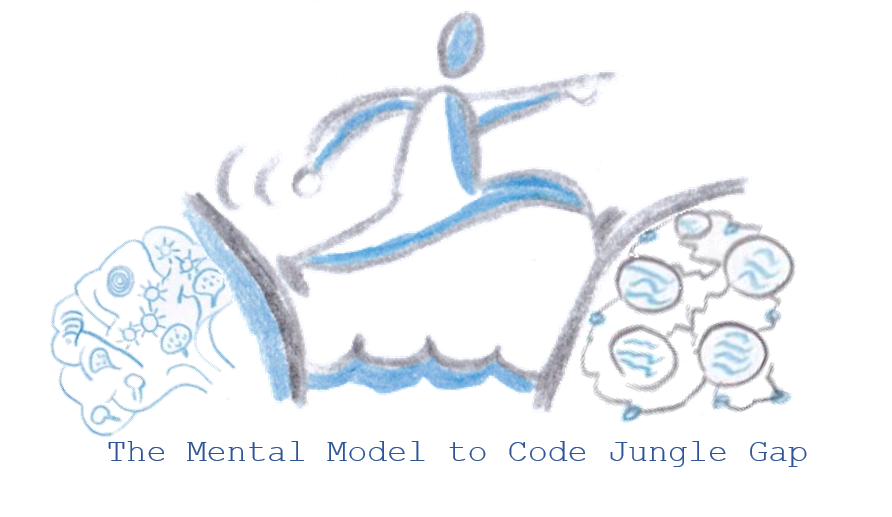

# Domain Driven Design as Usability for Coders (by Anita Kvamme)

## My Way into Modelling
Having a usability background, I learned years ago about a model which stated that if you are able to communicate the functionality by using a design model, which reflects the user´s mental model, you are more likely to get a system with a high degree of usability. This model is probably best known from Don Norman famous book The Design of Everyday Things published back in 1988.

A mental model is what the user believes they know about the system at hand. The users´ mental model for a business solution will be influenced by both their mental model of the business and their mental model of how these types of solutions typically work. 

The user unconsciously exploits this model to predict the system´s behaviour. In order to design a solution with high degree of usability, the designer model must be as close as possible to the user´s mental model. That way, a user will be more likely to correctly predict how the solution works. 

As a UX person I love usability testing where users are thinking aloud when they perform their tasks, since this gives me a sneak peek into how they are thinking and by that getting real insights into their mental model. This insight can be exploited to adjust the designer´s model, and for me chasing the ultimate designer model, was my door to into the world of modelling. 

Many years later the company I worked for had hired Eric Evans himself to help us using DDD. I clearly remember him on stage of our biggest auditorium asking if anyone had any stories about modelling to share. There I was, having the stories based on years of experience with user interface design, but lacking the courage to share them.

What I wanted to share were stories from real project where the focus on the designer´s model also lead to changes in how the technical solution was implemented. One time when I asked the rest of my team, "where does "concept X" belong in our design model", we agreed that the concept would not make sense for a user and should not be visible through the user interface. After deciding that, it was a short way to remove the concept completely from the technical design, all the way down to the database model. In this case, the focus on usability influenced the codebase in a similar fashion as DDD want us to do, and this was years before the famous blue book. 

## The Coder´s Mental Model
Domain modelling is an important part of DDD, and this makes it easier to solve the complex business problems. However, I believe DDD has another benefit as well, namely making a good environment for coders to build a useful mental model. So, what do I mean by that? 

Jessica Kerr said in her brilliant keynote at Explore DDD that a mental model must be mad by continuous adding bits of understanding. And she pointed out that this explains why there is so many Java Script frameworks out there. That is because it is much easier to make your own, and at the same time incrementally building the mental model of how it works, than to build a correct mental model of an existing framework. 

With a complex business application with a set of bounded contexts rewrite isn´t typically an option. So, we need another way of helping experience coders and newbies in the team to build a share understanding, and by that be more likely to build similar and useful mental models that will offer real guidance in the code jungle. 

To apply the same pattern as used for years in the usability area, the goal should be to make a codebase structured in such a way that the coder´s mental model will help the them to correctly predict how to navigate in, and enhance, the code. Because, when I find my way around the code written by others, it´s my mental model of the codebase that leads the way. And similar, when I code, it is my mental model of the codebase, in combination of my belief of how we as a team want it to be structured, that guides my coding. 

The mental model is internal to each coder´s brain and will differ. As Jakob Nilsen, an well know usability expert, states mental models are in flux exactly because they're embedded in a brain rather than fixed in an external medium. Additional experience with the system can obviously change the model, but users might also update their mental models based on stimuli from elsewhere, such as talking to other users or even applying lessons from other systems.

However, even though we cannot predict the coder´s mental model of the codebase or decided that all coders should have the same model, it is possible to structure the codebase in such a way that it is more likely that the coder´s mental model will give correct predictions. So, what influence the coder´s mental model in this context?

* Inside the potentially huge amount of code which implements the domain behaviour, when applying DDD right by using the ubiquitous language explicit in the code, everybody that share an understanding of this language will have a common foundation that helps them to build a useful mental model.  And coders not knowing the business domain will benefit from using time to learn the domain to enhance their mental model, instead of using time to wandering around in a code landscape where all the words are more randomly chosen. 
* In a huge and complex business area, having strict boundaries between different bounded context will make it possible for the users to predict what bounded context a give piece of functionality belongs to. 
* Applying architecture patterns, as for instance the hexagonal architecture, will influence where to look for repository code, app service code and domain code. If the coder´s do not know this architecture pattern, acquiring this knowledge helps building this understanding. 

Together all these aspects will highly influence the coder´s mental model of the codebase. However, learning more about the domain and the chosen technical architecture will only have a positive influence on the coder´s mental model given that the solution is implemented in a consistent manner. On the other hand, if the functionality is placed inside the wrong bounded context, if the domain logic has leaked into the repository, or if a change of the language isn´t reflected in the code, the coder´s mental model is likely to be misleading. Therefore, not following these DDD principles does not only make the IT solution building up technical debt, it also makes the foundation for the coders to build a useful mental model weaker. 

## Minimizing the Mental Model to Code Jungle Gap
The same way that people in the usability area for decades have work against minimizing the gap between the designer´s model and the user´s mental model, DDD is a powerful set of principles to facilitate for a small as possible gap between the coder´s mental model of the codebase and the code. So for me, applying DDD isn´t just fun and useful when implementing complex business functionality, it is actually usability for the coders.

Sometimes I wonder, if it is this usability aspect of DDD that is the explanation for when having started to apply DDD, it is seems hard to stop. And who knows, maybe that is part of the reason why DDD is celebrating 15. years anniversary with increasing popularity. 

## References
- The Design of Everyday Things, author: Dan Norman, published in 1988.
- Jessica Kerr´s Keynote at Explore DDD 2018: <https://www.youtube.com/watch?v=nVRUv30coyA>
- Jakob Nielsen article about Mental Models: <https://www.nngroup.com/articles/mental-models/>
